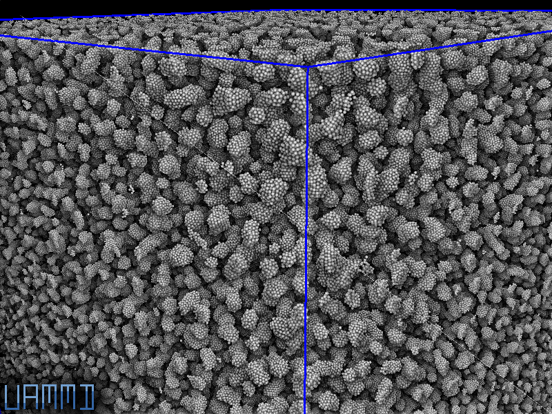
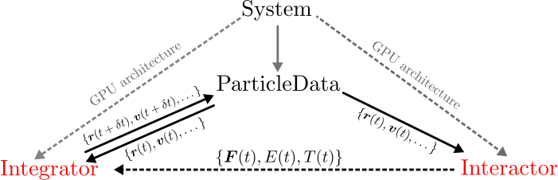

.. UAMMD documentation master file, created by
   sphinx-quickstart on Fri Jan 14 11:28:46 2022.
   You can adapt this file completely to your liking, but it should at least
   contain the root `toctree` directive.

Welcome to the UAMMD v2.0 documentation!
=========================================
----------------------------------------------------
Universally Adaptable Multiscale Molecular Dynamics 
----------------------------------------------------

	    10 Million LJ particles in a box with a low temperature thermostat. Ran on a GTX 980.

Screenshot made with `superpunto <https://github.com/RaulPPelaez/superpunto/](https://github.com/RaulPPelaez/superpunto/tree/SDL_OGL45>`_! 

For information about a particular module, see its page. You will find the most up to date information about a module in its header file.  

-----

About
======

UAMMD is a software infrastructure for complex fluids simulations for the GPU, presented as a CUDA/C++14 header-only library. UAMMD is intended to be hackable and copy-pastable.

Although "Molecular Dynamics" is part of the name,the UAMMD framework allows for much more than that. To this moment multiple integrators are implemented allowing it to perform:

- Molecular dynamics (MD)  
- Brownian Dynamics  (BD)  
- Brownian Hydrodynamics (BDHI)  
- Dissipative Particle Dynamics (DPD)  
- Smoothed Particle Hydrodynamics (SPH)  
- Metropolis Monte Carlo (MC)   
- Lattice Boltzmann (LBM)(WIP)  
- Fluctuating Hydrodynamics (coupled with particles with Immerse Boundary Method (IBM))  

Building blocks are provided for the user to construct a certain simulation. Most are highly templated to ease adaptability.

For example, there is no harmonic trap module, but you can write a simple functor (directly in device code!) stating that each particle should experiment a force when it is trying to leave the box. Then you can pass this functor to the ExternalForces module. Similar things can be achieved with a bonded force, an interaction that needs to trasverse a neighbour list, an nbody interaction...

Hop on to the examples folder for an introduction or check the docs for more information.

**Compiling and running any code containing UAMMD requires a GPU and a system with a working CUDA environment**. CUDA is free and you can download it here:

 - https://developer.nvidia.com/cuda-toolkit

On the other hand **understanding and modifying UAMMD code will require at least basic knowledge of GPU programming with CUDA**. There are a lot of resources online to learn CUDA, but you can start here:

 - https://developer.nvidia.com/blog/even-easier-introduction-cuda/  

If this is the first time you encounter UAMMD and want a quick start guide check the :doc:`QuickStart`.

Look in :doc:`Compiling-UAMMD` if some Makefile gives you troubles. The :doc:`FAQ` is also a good source of knowledge.  

UAMMD is a header only framework and it is mostly self contained in terms of dependencies so compilation should not be too troubling.  

The four basic assumptions
=============================

	    The basic conceptual hierarchy in UAMMD.

The foundational concepts of UAMMD are supported on a handful of (deliberately) vague assumptions which can be summarize in four:

.. rst-class:: centered

.. topic:: **1.** The :doc:`System` assumption:
	       
  The code will run primarily on a GPU (the most limiting assumption in the development process).

.. rst-class:: centered
		 
.. topic:: **2.** The :doc:`ParticleData` assumption:

  Simulations are based on the state of "particles" (whatever a particle and its state mean).
  
.. rst-class:: centered
	       
.. topic:: **3.** The :doc:`Integrator </Integrator/index>` assumption:

  The state of these particles changes in time.

.. rst-class:: centered
	       
.. topic:: **4.** The :doc:`Interactor </Interactor/index>` assumption:

  Particles can interact with each other and/or with an external influence.

----------------------

A quick example:
=================

A brief example of how a code using UAMMD typically looks like. In this example  we have a simulation of non-interacting Brownian particles.

**UAMMD does not need to be compiled separatedly (it is header only).**

Some special flags might be needed to compile codes including with certain UAMMD headers, see Compiling UAMMD.
Here you have a short example of how a typical UAMMD code looks like:

.. code:: cpp
	  
  //Ideal brownian particles
  #include"uammd.cuh"
  #include"Integrator/BrownianDynamics.cuh"
  using namespace uammd;
  int main(){
    int numberParticles = 1e5;
    auto pd = make_shared<ParticleData>(numberParticles);
    {
      auto pos = pd->getPos(access::cpu, access::write);
      std::generate(pos.begin(), pos.end(),
                   [&](){ return make_real4(sys->rng.uniform3(-0.5, 0.5), 0);});	
    }
    BD::EulerMaruyama::Parameters par;
    par.temperature = 1.0;
    par.viscosity = 1.0;
    par.hydrodynamicRadius = 1.0;
    par.dt = 0.1;
    auto bd = make_shared<BD::EulerMaruyama>(pd, par);
    int numberSteps=100;
    for(int i = 0; i<numberSteps; i++){
    	bd->forwardTime();
    }
    return 0;
  }

A plethora of guided examples are available in the repository.  

.. toctree::
   :hidden:
   :maxdepth: 4
   :caption: First steps
	     
   QuickStart
   Compiling-UAMMD
   SimulationFile
   FAQ
   Examples

.. toctree::
   :hidden:
   :maxdepth: 4
   :caption: Base modules
	     
   System
   ParticleData
   Integrator/index
   Interactor/index

.. toctree::
   :hidden:
   :maxdepth: 4
   :caption: Concepts
	     
   SimulationDomain   
   NeighbourLists
   ImmersedBoundary
   Transverser
   Potential
      
.. toctree::
   :maxdepth: 4
   :hidden:
   :caption: Available Integrators

   Integrator/MolecularDynamics
   Integrator/LangevinDynamics
   Integrator/BrownianDynamics
   Integrator/BrownianHydrodynamics
   Integrator/FluctuatingHydrodynamics   
   Integrator/MonteCarlo

.. toctree::
   :maxdepth: 4
   :hidden:
   :caption: Available Interactors

   Interactor/ExternalForces
   Interactor/BondedForces
   Interactor/PairForces
   Interactor/Electrostatics   

   
.. toctree::
   :hidden:
   :maxdepth: 4
   :caption: Other concepts and utilities
   
   ParameterUpdatable
   InputFile
   TabulatedFunctions   
   Grid
   ParticleSorter
   ErrorHandling
   ProgrammingTools
   Postprocessing
   
   
	     
Indices and tables
==================
   
* :ref:`genindex`
* :ref:`modindex`
* :ref:`search`
